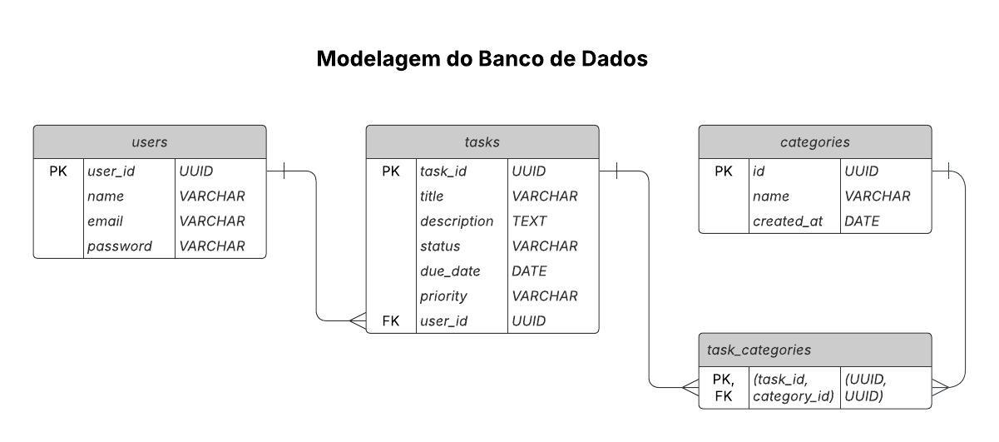

# Web Application Document - Projeto Individual - Módulo 2 - Inteli

## Gerenciador de Tarefas

#### Leonardo Ramos Vieira

## Sumário

1. [Introdução](#c1)
2. [Visão Geral da Aplicação Web](#c2)
3. [Projeto Técnico da Aplicação Web](#c3)
4. [Desenvolvimento da Aplicação Web](#c4)
5. [Referências](#c5)

<br>

## <a name="c1"></a>1. Introdução

Em um mundo cada vez mais dinâmico e repleto de demandas, a capacidade de se organizar e manter a produtividade tornou-se essencial tanto no âmbito pessoal quanto profissional. Pensando nisso, este projeto propõe o desenvolvimento de um gerenciador de tarefas que tem como principal objetivo oferecer uma solução simples, eficiente e intuitiva para auxiliar usuários na gestão de suas atividades diárias. A proposta é centralizar tarefas, permitir o acompanhamento do progresso e facilitar a priorização de compromissos, contribuindo diretamente para uma rotina mais estruturada e produtiva. Dessa forma, este sistema foi desenvolvido a fim armazenar informações e promover hábitos de organização que impactem positivamente o dia a dia do usuário.

---

## <a name="c3"></a>2. Projeto da Aplicação Web

### 2.1. Modelagem do banco de dados

A modelagem de dados é uma etapa fundamental no desenvolvimento de sistemas, pois define como as informações serão organizadas, armazenadas e relacionadas dentro do banco de dados. Nesse sentido, uma estrutura bem planejada garante integridade, eficiência e escalabilidade ao projeto.

Dessa forma, apresenta-se a seguir a modelagem relacional, que tem como foco a identificação das entidades envolvidas no sistema (como usuários, tarefas e categorias), bem como a definição de seus atributos e dos relacionamentos entre elas, representados por meio de diagramas Entidade-Relacionamento. Ademais, é disponibilizada também a modelagem física, responsável por traduzir essa estrutura lógica em instruções SQL, especificando como as tabelas, campos, chaves e restrições serão efetivamente implementados no banco de dados real.

<div align="center">

<sub>Modelagem Relacional </sub>



<sub>Modelagem Física </sub>

</div>

```
-- init.sql

-- Tabela de Usuários
CREATE TABLE IF NOT EXISTS users (
  id UUID PRIMARY KEY DEFAULT gen_random_uuid(),
  name VARCHAR(100) NOT NULL,
  email VARCHAR(100) UNIQUE NOT NULL,
  password VARCHAR(100) NOT NULL
);

-- Tabela de Tarefas
CREATE TABLE IF NOT EXISTS tasks (
  id UUID PRIMARY KEY DEFAULT gen_random_uuid(),
  title VARCHAR(255) NOT NULL,
  description TEXT,
  status VARCHAR(50) CHECK (status IN ('Pendente', 'Em Progresso', 'Concluída')) DEFAULT 'Pendente',
  due_date DATE,
  priority VARCHAR(50) CHECK (priority IN ('Baixa', 'Média', 'Alta')) DEFAULT 'Média',
  user_id UUID REFERENCES users(id) ON DELETE CASCADE
);

-- Tabela de Categorias
CREATE TABLE IF NOT EXISTS categories (
  id UUID PRIMARY KEY DEFAULT gen_random_uuid(),
  name VARCHAR(100) NOT NULL,
  created_at DATE
);

-- Tabela de Relacionamento entre Tarefas e Categorias
CREATE TABLE IF NOT EXISTS task_categories (
  task_id UUID REFERENCES tasks(id) ON DELETE CASCADE,
  category_id UUID REFERENCES categories(id) ON DELETE CASCADE,
  PRIMARY KEY (task_id, category_id)
);
```

### 2.1.1 BD e Models 

**Usuário (User):**

- id (UUID, PK)
- name (string, obrigatório)
- email (string, obrigatório, único)
- password (string, obrigatório)

**Tarefa (Task):**

- id (UUID, PK)
- title (string, obrigatório)
- description (texto, opcional)
- status (string, valores: Pendente, Em Progresso, Concluída)
- due_date (data, opcional)
- priority (string, valores: Baixa, Média, Alta)
- user_id (UUID, FK para User)

**Categoria (Category):**

- id (UUID, PK)
- name (string, obrigatório)
- created_at (data)

**TaskCategory (Relacionamento):**

- task_id (UUID, FK para Task)
- category_id (UUID, FK para Category)

### 2.2. Arquitetura 

A arquitetura segue o padrão MVC (Model-View-Controller):

- **Model:** Responsável pela lógica de dados e comunicação com o banco (Sequelize Models).
- **View:** Interface do usuário, renderizada com EJS.
- **Controller:** Recebe requisições, processa regras de negócio e retorna respostas.

Fluxo:

1. O usuário interage com a View (interface web).
2. A View envia requisições para o Controller.
3. O Controller processa a requisição, acessa o Model se necessário.
4. O Model interage com o banco de dados e retorna dados ao Controller.
5. O Controller envia resposta para a View.

```
Usuário <-> View (EJS) <-> Controller <-> Model <-> Banco de Dados
```

### 2.3. WebAPI e endpoints 

**Usuários**

- `GET /api/users` — Lista todos os usuários
- `GET /api/users/:id` — Detalha um usuário
- `POST /api/users` — Cria um novo usuário
- `PUT /api/users/:id` — Atualiza um usuário
- `DELETE /api/users/:id` — Remove um usuário

**Tarefas**

- `GET /api/tasks` — Lista todas as tarefas
- `GET /api/tasks/:id` — Detalha uma tarefa
- `POST /api/tasks` — Cria uma nova tarefa
- `PUT /api/tasks/:id` — Atualiza uma tarefa
- `DELETE /api/tasks/:id` — Remove uma tarefa

**Categorias**

- `GET /api/categories` — Lista todas as categorias
- `GET /api/categories/:id` — Detalha uma categoria
- `POST /api/categories` — Cria uma nova categoria
- `PUT /api/categories/:id` — Atualiza uma categoria
- `DELETE /api/categories/:id` — Remove uma categoria

**Relacionamento Tarefa-Categoria**

- `GET /api/task-categories` — Lista todos os relacionamentos
- `GET /api/task-categories/:id` — Detalha um relacionamento
- `POST /api/task-categories` — Cria um novo relacionamento
- `PUT /api/task-categories/:id` — Atualiza um relacionamento
- `DELETE /api/task-categories/:id` — Remove um relacionamento

---

## <a name="c4"></a>4. Desenvolvimento da Aplicação Web (Semana 8)

### 4.1 Demonstração do Sistema Web (Semana 8)

_VIDEO: Insira o link do vídeo demonstrativo nesta seção_
_Descreva e ilustre aqui o desenvolvimento do sistema web completo, explicando brevemente o que foi entregue em termos de código e sistema. Utilize prints de tela para ilustrar._

### 4.2 Conclusões e Trabalhos Futuros (Semana 8)

_Indique pontos fortes e pontos a melhorar de maneira geral._
_Relacione também quaisquer outras ideias que você tenha para melhorias futuras._

## <a name="c5"></a>5. Referências

_Incluir as principais referências de seu projeto, para que o leitor possa consultar caso ele se interessar em aprofundar._<br>

---

---
